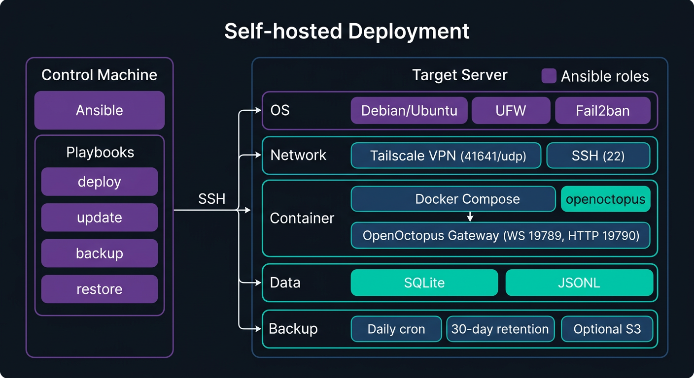
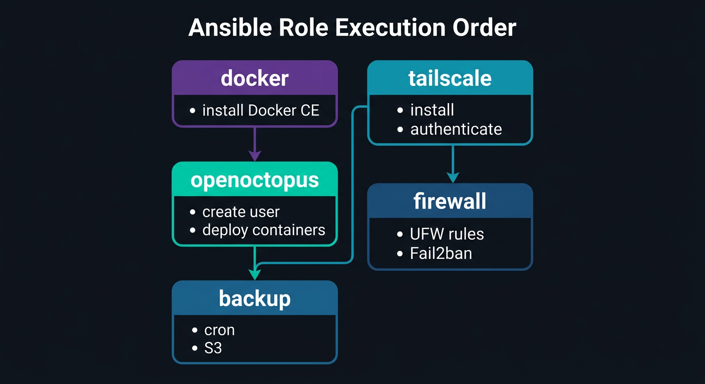

<p align="center">
  <picture>
    <source media="(prefers-color-scheme: light)" srcset="https://raw.githubusercontent.com/open-octopus/openoctopus.club/main/src/assets/brand/logo-dark.png">
    
  </picture>
</p>

<h3 align="center">openoctopus-ansible</h3>

<p align="center">
  Automated self-hosted deployment with Docker, Tailscale, and firewall isolation.
</p>

<p align="center">
  <a href="https://github.com/open-octopus/openoctopus-ansible/blob/main/LICENSE"></a>
  <a href="#"></a>
  <a href="https://github.com/open-octopus/openoctopus"></a>
  <a href="https://discord.gg/mwNTk8g5fV"></a>
</p>

---

## What is openoctopus-ansible?

**openoctopus-ansible** provides [Ansible](https://www.ansible.com/) playbooks for deploying OpenOctopus on your own server. It automates the full setup: Docker containers, Tailscale VPN for secure remote access, firewall hardening, and automated backups.

OpenOctopus is **local-first** by design — your family data never leaves your home. Phase 2 targets Raspberry Pi as a dedicated home hub device.

## Prerequisites

- **Ansible >= 2.15** installed on your control machine
- **Python >= 3.10** on the control machine
- **Debian 11+ / Ubuntu 22.04+** on the target server
- **SSH key-based access** to the target server
- **Tailscale account** (free tier, optional but recommended)

## Quick Start

```bash
# 1. Clone this repo
git clone https://github.com/open-octopus/openoctopus-ansible.git
cd openoctopus-ansible

# 2. Install Ansible Galaxy dependencies
ansible-galaxy install -r requirements.yml

# 3. Copy and edit the inventory
cp inventory.example.yml inventory.yml
# Edit inventory.yml with your server IP and SSH details

# 4. Copy and edit variables
cp vars.example.yml vars.yml
# Edit vars.yml -- at minimum, set an LLM provider API key

# 5. Deploy (dry run first)
ansible-playbook deploy.yml -i inventory.yml -e @vars.yml --check --diff

# 6. Deploy for real
ansible-playbook deploy.yml -i inventory.yml -e @vars.yml
```

## Playbooks

| Playbook | Purpose | Usage |
|----------|---------|-------|
| `deploy.yml` | Full initial deployment | `ansible-playbook deploy.yml -i inventory.yml -e @vars.yml` |
| `update.yml` | Pull latest images, restart | `ansible-playbook update.yml -i inventory.yml -e @vars.yml` |
| `backup.yml` | Trigger manual backup | `ansible-playbook backup.yml -i inventory.yml -e @vars.yml` |
| `restore.yml` | Restore from backup | `ansible-playbook restore.yml -i inventory.yml -e @vars.yml -e backup_file=/path/to/backup.tar.gz` |

## What Gets Deployed

| Component | Purpose |
|-----------|---------|
| Docker CE + Compose V2 | Container runtime |
| OpenOctopus gateway | Agent gateway (WS :19789 + HTTP :19790) |
| Tailscale | Mesh VPN for secure remote access (optional) |
| UFW firewall | Default deny incoming, allow SSH + Tailscale only |
| Fail2ban | SSH brute-force protection |
| Backup cron | Daily SQLite + JSONL session backup |

## Architecture

<p align="center">
  
</p>

## Configuration Variables

All variables are documented in `vars.example.yml`. Key settings:

| Variable | Default | Description |
|----------|---------|-------------|
| `openoctopus_version` | `latest` | Docker image tag |
| `openoctopus_user` | `octopus` | System user |
| `openoctopus_home` | `/opt/openoctopus` | Installation directory |
| `openoctopus_ws_port` | `19789` | WebSocket RPC port |
| `openoctopus_http_port` | `19790` | HTTP REST port |
| `anthropic_api_key` | `""` | Anthropic API key |
| `tailscale_auth_key` | `""` | Tailscale auth key (enables Tailscale role) |
| `backup_enabled` | `true` | Enable daily backup cron |
| `backup_retention_days` | `30` | Days to keep local backups |
| `ufw_ssh_port` | `22` | SSH port for firewall rules |

## Security

- **Public ports**: Only SSH and Tailscale (41641/udp) are exposed
- **Fail2ban**: SSH brute-force protection (5 attempts = 1 hour ban)
- **UFW**: Default deny incoming, allow outgoing
- **Non-root**: OpenOctopus runs as an unprivileged `octopus` user
- **Config permissions**: API keys in config.json5 are mode 0600

Verify after deployment:
```bash
nmap -p- YOUR_SERVER_IP
# Should show only port 22 (SSH) open from the public internet
```

## Roles

| Role | Description |
|------|-------------|
| `docker` | Installs Docker CE + Compose V2, adds user to docker group |
| `openoctopus` | Creates system user, generates config, deploys containers |
| `tailscale` | Installs Tailscale, authenticates, enables IP forwarding |
| `firewall` | Configures UFW rules + Fail2ban SSH jail |
| `backup` | Sets up backup script, cron job, optional S3 upload |

<p align="center">
  
</p>

## Repository Structure

```
openoctopus-ansible/
├── ansible.cfg
├── requirements.yml
├── inventory.example.yml
├── vars.example.yml
├── deploy.yml
├── update.yml
├── backup.yml
├── restore.yml
├── .gitignore
└── roles/
    ├── docker/
    ├── openoctopus/
    ├── tailscale/
    ├── firewall/
    └── backup/
```

## Related Projects

| Project | Description |
|---------|-------------|
| [openoctopus](https://github.com/open-octopus/openoctopus) | Core monorepo |
| [homebrew-tap](https://github.com/open-octopus/homebrew-tap) | macOS/Linux install via Homebrew |

## License

[MIT](LICENSE)
